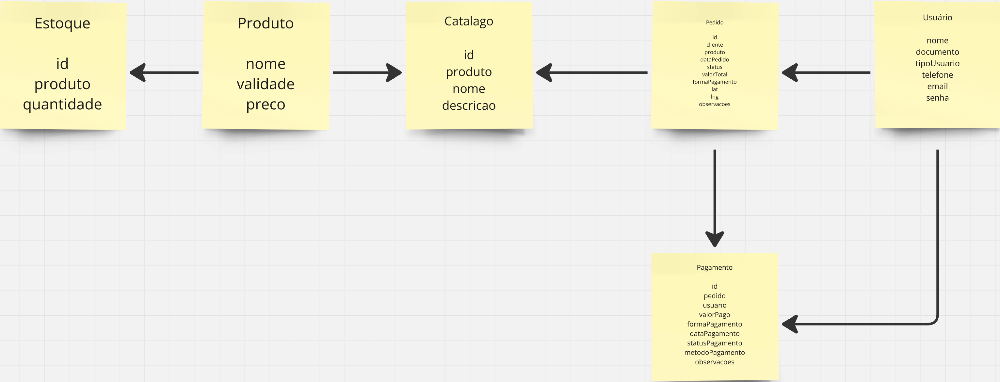

# 📚 Trabalho - Design Tático no DDD

## 📌 Objetivo
Criar as **Entidades, Value Objects, Agregados e Repositórios** do seu projeto, aplicando o **Design Tático do DDD**.

---

## **📝 1️⃣ Atividade Prática: Modelagem do Domínio**

📌 **Objetivo:**  
Criar as **3 Entidades, 2 Value Objects, 1 Agregados e 1 Repositórios** do seu projeto.  

Exemplo: [Modelagem DDD repo](https://github.com/ProfThiagoVicco/ModelagemDDD)

### Entidades:
1. Usuario
2. Produto
3. Estoque

### Value Objects:
1. Endereco/Localizacao
2. PratoPedido

### Agreggate:
1. Pedido

### Repository:
1. Pedido

📌 **Instruções:**  
1️⃣ **Identifique as Entidades e Value Objects** do seu domínio.  
2️⃣ **Defina os Agregados e seu Aggregate Root**.  
3️⃣ **Implemente um diagrama mostrando as relações entre os elementos**.

4️⃣ **Crie a interface do repositório para persistência do agregado**.  
[Modelagem](./modelagem.ts)