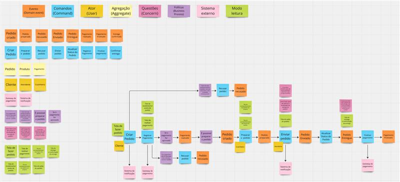

# 📌 Atividade de Event Storming

- Mapeamento de Eventos de Domínio
- Identificação de Comandos e Atores
- Descobrindo Regras e Políticas de Negócio
- Identificação dos Bounded Contexts
- Discussão e Refinamento

---

## Entrega

https://miro.com/app/board/uXjVIesNoQs=/?share_link_id=96208179386
