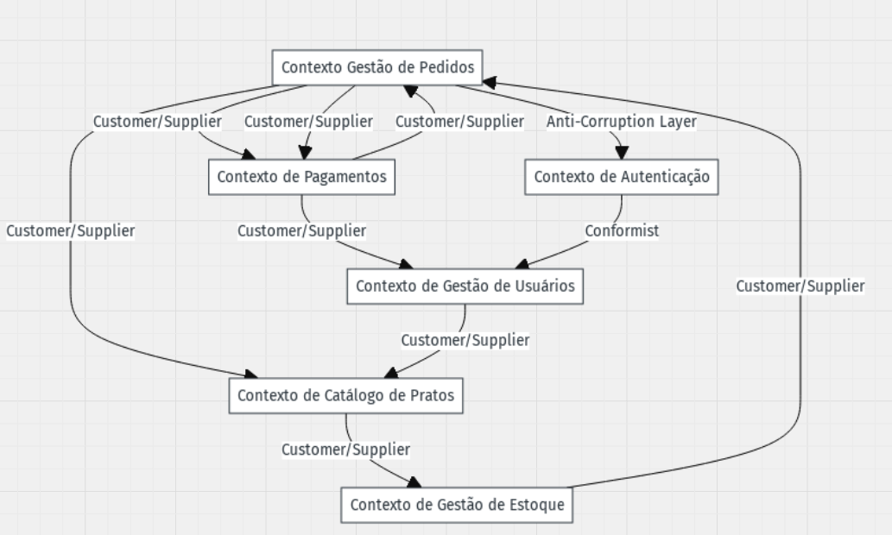

# Dinâmica: Design Estratégico do Pede Ai

## Objetivo

Identificar os subdomínios do **Pede Ai**, classificá-los (Core, Supporting, Generic) e desenhar os bounded contexts, incluindo suas interações. Esse exercício ajudará a criar uma visão clara e estratégica do domínio.

---

## 1. Nome do Projeto

**Pede Ai**

---

## 2. Objetivo Principal do Pede Ai

O objetivo principal é resolver o problema de ineficiência do atendimento, acarretando em perda de faturamente e insatisfação dos clientes e estabelecimentos.

---

## 3. Identificação dos Subdomínios

Liste os subdomínios do sistema e classifique-os como **Core Domain**, **Supporting Subdomain** ou **Generic Subdomain**.

| **Subdomínio**            | **Descrição**                                                                              | **Tipo**    |
| ------------------------- | ------------------------------------------------------------------------------------------ | ----------- |
| Gestão de Pedidos         | Gerencia os pedidos realizados pelos clientes                                              | Core Domain |
| Gestão de Usuários        | Gerencia o cadastro dos clientes e responsáveis do estabelecimento.                        | Supporting  |
| Catálogo de Pratos (menu) | Gerencia e lista os pratos que podem ser pedidos pelos clientes                            | Supporting  |
| Gestão de estoque         | Gerencia o estoque do estabelecimento (quantidade de produtos, variedade de produtos, etc) | Supporting  |
| Pagamentos                | Processa pagamentos e repassa valores para os estabelecimentos.                            | Generic     |
| Autenticação de Usuários  | Gerencia login, permissões e segurança de acesso.                                          | Generic     |

---

## 4. Desenho dos Bounded Contexts

Liste e descreva os bounded contexts identificados no projeto. Explique a responsabilidade de cada um.

| **Bounded Context**                   | **Responsabilidade**                                                                 | **Subdomínios Relacionados**                                    |
| ------------------------------------- | ------------------------------------------------------------------------------------ | --------------------------------------------------------------- |
| Contexto Gestão de Pedidos            | Gerencia todo o processo de pedidos feitos até a entrega do pedido para o cliente    | Gestão de Pedidos, Catálogo de pratos (menu), Pagamentos        |
| Contexto de Gestão de Usuários        | Centraliza o cadastro de clientes e estabelecimentos, armazenado informações basicas | Gestão de Usuários                                              |
| Contexto de Catálogo de Pratos (menu) | Processa cobranças de pedidos feitos pelos clientes                                  | Gestão de estoque, Catálogo de pratos (menu), Gestão de Pedidos |
| Contexto de Gestão de estoque         | Gerencia o processo das quantidades de produtos, variedade de produtos, etc          | Gestão de estoque                                               |
| Contexto de Pagamentos                | Processa cobranças dos pedidos e repasses para os estabelecimentos                   | Pagamentos                                                      |
| Contexto de Autenticação              | Controla login, cadastro e permissões de usuários (estabelecimentos e clientes).     | Autenticação de Usuários                                        |

---

## 5. Comunicação entre os Bounded Contexts

Explique como os bounded contexts vão se comunicar. Use os padrões de comunicação, como:

- **Mensageria/Eventos (desacoplado):** Ex.: O Contexto de Consultas emite um evento "Consulta Finalizada", consumido pelo Contexto de Pagamentos.
- **APIs (síncrono):** Ex.: O Contexto de Pagamentos consulta informações de preços no Contexto de Consultas.

| **De (Origem)** | **Para (Destino)** | **Forma de Comunicação** | **Exemplo de Evento/Chamada** |
| **De (Origem)** | **Para (Destino)** | **Forma de Comunicação** | **Exemplo de Evento/Chamada** |
| ------------------------------------- | ------------------------------ | ------------------------ | ------------------------------------------------------- |
| Contexto Gestão de Pedidos | Contexto de Catálogo de Pratos | API | Obter lista de pratos disponíveis no cardápio |
| Contexto Gestão de Pedidos | Contexto de Pagamentos | API | Enviar pedido para processamento de pagamento |
| Contexto de Catálogo de Pratos | Contexto de Gestão de Estoque | API | Verificar disponibilidade de ingredientes para prato |
| Contexto de Gestão de Estoque | Contexto de Gestão de Pedidos | API | Atualizar estoque após o pedido ser confirmado |
| Contexto de Pagamentos | Contexto de Gestão de Pedidos | API | Notificar sobre o status do pagamento (confirmado/falhou) |
| Contexto de Pagamentos | Contexto de Gestão de Usuários | API | Enviar dados do cliente para validação de pagamento |
| Contexto de Autenticação | Contexto de Gestão de Usuários | API | Validar login e permissões do usuário |
| Contexto de Gestão de Usuários | Contexto de Catálogo de Pratos | API | Consultar informações do cliente (preferências, histórico) |
| Contexto de Gestão de Pedidos | Contexto de Autenticação | API | Validar dados do usuário ao realizar pedido |
| Contexto de Gestão de Pedidos | Contexto de Pagamentos | Evento | Evento "Pedido Finalizado", que dispara o processo de pagamento |
| Contexto de Pagamentos | Contexto de Gestão de Usuários | API | Obter dados do cliente |
| Contexto Catálogo de Pratos (menu) | Contexto de Gestão de Estoque | API | Obter ingredientes disponíveis |
| Contexto de Autenticação | Contexto de Gestão de Usuário | API | Validar login e permissões |

---

## 6. Definição da Linguagem Ubíqua

Liste os termos principais da Linguagem Ubíqua do projeto. Explique brevemente cada termo.

| **Termo**                 | **Descrição**                                                                      |
| ------------------------- | ---------------------------------------------------------------------------------- |
| Pedidos                   | Um prato que e solicitando pelo usuario ao estabelecimento                         |
| Estabelecimento           | Empresa responsavel para fazer o prato                                             |
| Catálogo de pratos (menu) | Lista dos pratos que o estabelecimento fornece                                     |
| Pagamento                 | Transação financeira realizada pelo cliente para pagaar a conta do estabelecimento |
| Estoque                   | Produtos necessarios para a produção do prato                                      |
| Clients                   | Usuario que realiza pedidos                                                        |
| Estabelecimentos          | Usuario que realiza/prepara os pratos                                              |

---

## 7. Estratégia de Desenvolvimento

Para cada tipo de subdomínio, explique a abordagem para implementação:

- **Core Domain:** Desenvolver internamente com foco total.
- **Supporting Subdomain:** Desenvolver internamente ou parcialmente terceirizar.
- **Generic Subdomain:** Usar ferramentas ou serviços de mercado.

| **Subdomínio**            | **Estratégia**                 | **Ferramentas ou Serviços (se aplicável)** |
| ------------------------- | ------------------------------ | ------------------------------------------ |
| Gestão de Pedidos         | Desenvolvimento interno        |                                            |
| Catálogo de pratos (menu) | Desenvolvimento interno        |                                            |
| Gestão de Usuários        | Desenvolvimento interno        |                                            |
| Autenticação de Usuários  | Usar serviço externo           | Auth0                                      |
| Pagamentos                | Terceirizar usando API Pagarme | Pagarme                                    |

---

## 8. Diagrama Visual (Opcional, mas Recomendado)

Desenhe um diagrama que mostre:

- Os bounded contexts.
- Como eles se comunicam.
- A relação com os subdomínios.

Use ferramentas como **Miro**, **Lucidchart** ou mesmo papel e caneta para criar seu diagrama e adicionar ao projeto.

---

## Dicas para Apresentação

- Explique cada parte do design, focando no **Core Domain** (o coração do negócio).
- Justifique por que certos subdomínios foram classificados como Supporting ou Generic.
- Destaque como a comunicação entre bounded contexts foi pensada para ser escalável.

---

Boa sorte com a dinâmica! 🚀
